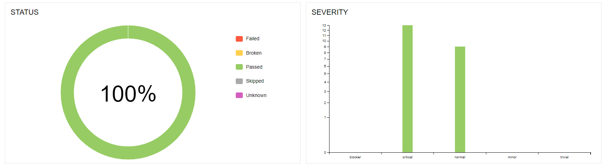
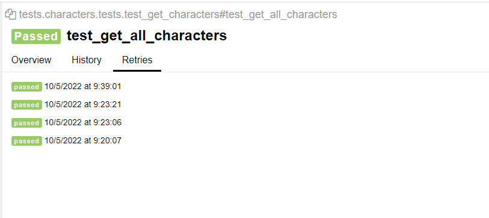
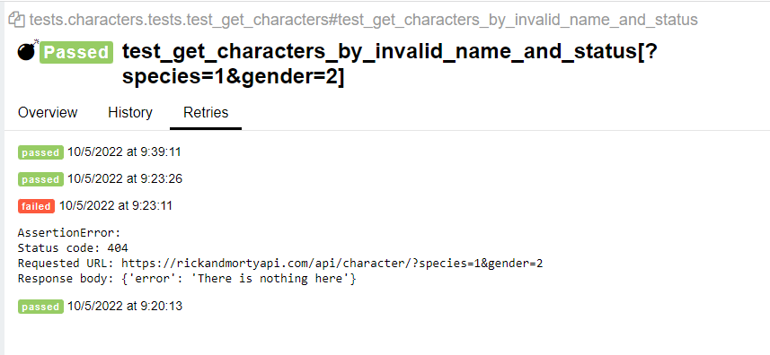

# Тренировочный проект автотестов на [Rick and Morty API](https://rickandmortyapi.com/)

##  Стек технологий:


##  Реализованы проверки:
- Проверка статус кода и валидация ответа при запросе 
    - всех персонажей
    - конкретного персонажа по полю id 
    - нескольких персонажей по полю id (параметризован)
    - персонажа с несуществующим id (параметризован)
    - персонажа с некорректным id (параметризован)
    - персонажа с фильтром по полю name (параметризован)
    - персонажей с несуществующим значением фильтра поля name
    - персонажей с фильтром по нескольким полям (параметризован)
    - персонажей с несуществующими значениями фильтров по нескольким полям (параметризован)

##  Запуск проекта:
- Запуск проекта локально:
```bash
pytest -v -k tests --alluredir=[path_to_report_dir]
```
- Для генерации Allure-репорта:
```bash
allure serve [path_to_report_dir]
```

##  Отчеты в Allure Report
- Графики

- Тестовые наборы

- История запуска теста


  

