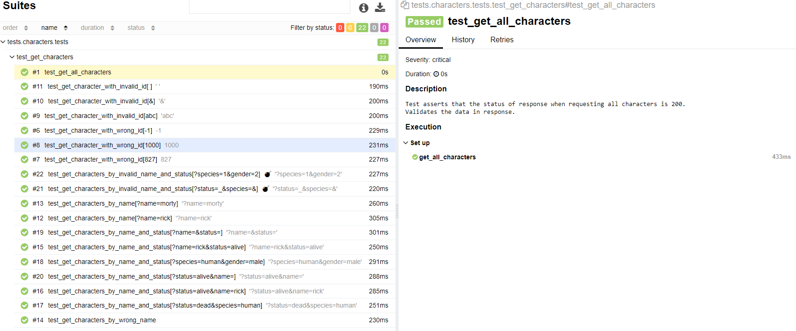

# Тренировочный проект автотестов на [Rick and Morty API](https://rickandmortyapi.com/)

##  Реализованы проверки:
- Проверка статус кода и валидация ответа при запросе всех персонажей
- Проверка статус кода и валидация ответа при запросе конкретного персонажа по полю id 
- Проверка статус кода и валидация ответа при запросе нескольких персонажей по полю id (с параметрами)
- Проверка статус кода и валидация ответа при запросе персонажа с несуществующим id (с параметрами)
- Проверка статус кода и валидация ответа при запросе персонажа с некорректным id (с параметрами)
- Проверка статус кода и валидация ответа при запросе персонажа с фильтром по полю name (с параметрами)
- Проверка статус кода и валидация ответа при запросе персонажей с несуществующим значением фильтра поля name
- Проверка статус кода и валидация ответа при запросе персонажей с фильтром по нескольким полям (с параметрами)
- Проверка статус кода и валидация ответа при запросе персонажей с несуществующими значениями фильтров по нескольким полям (с параметрами)

##  Запуск проекта:
- Запуск проекта локально:
```bash
pytest -v -k tests --alluredir=[path_to_report_dir]
```
- Для генерации Allure-репорта:
```bash
allure serve [path_to_report_dir]
```

##  Отчеты в Allure Report




